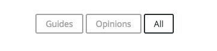

Adding filter/sorting functionality to our Jekyll blog is a must these days to keep things in order. We can get that functionality easily by using Isotope and as a bonus for our efforts we get the animation effect for free since that is part of the core functionality of the Isotope library.

Here's a preview of what we can expect this guide to help us accomplish:

### 1.0 Installing Isotope And It's Dependencies

First off, we need to add the Isotope library and it's depencies to our project. I prefer to link my Javascript files inside the footer of my Jekyll partial:

```html
<script src="{{ site.baseurl }}/assets/js/jquery-3.3.1.min.js"></script>
<script src="{{ site.baseurl }}/assets/js/isotope.pkgd.min.js"></script>
```

_project/\_includes/footer.html_

\*Notice that jQuery is a dependency here. Everything in this guide can be accomplished without jQuery by just substituting out the jQuery code with vanilla JS.

### 2.0 Adding Filter Funcionality To Our Posts

At the very top of our our Jekyll posts we have our **front matter** which by default allows us to specify the category of our post. This is the data that we will use to tell Isotope what to filter our posts by.

```yaml
---
layout: post
title: "Sample Post"
author: Mike Ray Arriaga
date: 2018-01-14 20:43:28 -0800
categories: guides
comments: true
---
```

There are two ways to let Isotope know by which attribute of our post-item html it can filter our posts by. We can either add a `data-*` attribute to the html of our post-link **OR** we can add an empty class to our posts html.

Something like this:

```html
<li class="post-item tutorial"></li>
```

For the sake of simplicity and since it allows us to take advantage of Jekyll's liquid syntax, let's add use the empty class method.

### 2.1 Telling Isotope What Elements To Effect

Isotope knows which elements we want to sort by searching specific classes on the parent element of our blog post list as well as each individual post.

We can specify what that class is but Isotope's documentation already has a straightforward example for us. In the Isotope docs, they use `<div>` elements in their example code but here I'll be using `<ul>` and `<li>` elements in the following example since our Blog posts are structured that way by default:

```html
<ul class="grid">
  <li class="grid-item"></li>
  <li class="grid-item"></li>
  <li class="grid-item"></li>
  <li class="grid-item"></li>
  <li class="grid-item"></li>
</ul>
```

Now let's add the `.grid` and `.grid-item` classes to our post list:

```html
<div class="post-list">
  <ul class="post-list grid">
    <li class="post-item grid-item">
      <h2>
        <a class="post-link" href="{{ post.url | relative_url }}"
          >{{ post.title | escape }}</a
        >
      </h2>
      <span class="post-meta">{{ post.date | date: date_format }}</span>
    </li>
  </ul>
</div>
```

### 2.2 Accessing Our Category Data With Liquid Syntax

Now we are going to access the categories data from the front matter of our posts to add an empty class to our post items so that Isotope filter our posts.

Using Jekylls liquid syntax, we can access that data inside the post-item `<li>` element:

```html
<div class="post-list">
  <ul class="post-list grid">
    <li class="post-item grid-item {{ post.categories }}">
      <h2>
        <a class="post-link" href="{{ post.url | relative_url }}"
          >{{ post.title | escape }}</a
        >
      </h2>
      <span class="post-meta">{{ post.date | date: date_format }}</span>
    </li>
  </ul>
</div>
```

**Important Note**

As long as our blog posts have only 1 catagory, our `post.categories` will return a single string. This is important because later on in this guide we will use liquid syntax to automagically create filter buttons that individually contain each category that we specify inside the front matter of our posts, potentially creating too many buttons on the page.

Alternatively, we could substitute `post.categories` for something more specific like `post.categories.first` but at this time of writing, I was unable to accomplish this.

### 3.0 Creating Filter Buttons Automagically

In order for Isotope to know which elements it will use to trigger sorting our posts, we need to add a the class `.filter-button-group` to the parent container of our filter buttons but we haven't made that yet. Let's do that now:

```html
<div class="post-filters-container filter-button-group">
  <a class="post-sort-btn" href="#/"></a>
  <a class="post-sort-btn" href="#/">All</a>
</div>
```

Here, we've made two `<a>` elements, one that will be act as template for our buttons which will be generated with some liquid syntax and a for loop, and the other being a generic sort button that will simply sort our posts by "All"

We now need to give our sort buttons a sudo attribute called `data-filter=""` which will trigger Isotope to filter posts by it's value.

```html
<div class="post-filters-container filter-button-group">
  <a class="post-sort-btn " href="#/" data-filter=".{{ category | first }}"
    >{{ category | first }}</a
  >
  <a class="post-sort-btn " href="#/" data-filter="*">All</a>
</div>
```

_Notice here that we prepend a `.` before our liquid syntax. This is because Isotope is going to look for a class with the value of our category in order for it to filter posts properly._

Now let's use some liquid syntax and a for loop to generate our sort buttons using the categories data from the front matter of all of our blog posts.

```html
<div class="post-filters-container filter-button-group">
  
  <a class="post-sort-btn " href="#/" data-filter=".{{ category | first }}"
    >{{ category | first }}</a
  >
  
  <a class="post-sort-btn " href="#/" data-filter="*">All</a>
</div>
```

Now we should see our filter buttons on the screen like this:



### 3.1 Initalizing Isotope

We're at the home stretch!

Now we have to simply initalize Isotope in our main.js:

```javascript
// isotope initializer
var elem = document.querySelector(".grid");
var iso = new Isotope(elem, {
  // options
  itemSelector: ".grid-item",
  layoutMode: "fitRows",
});

// element argument can be a selector string
//   for an individual element
var iso = new Isotope(".grid", {
  // options
});
```

Finally we can add our sort functionality using jQuery:

```javascript
// filter posts on button click
$(".post-sort-btn").on("click", function () {
  var filterValue = $(this).attr("data-filter");
  // use filter function if value matches
  filterValue = filterFns[filterValue] || filterValue;
  $grid.isotope({
    filter: filterValue,
  });
});
```

We can subsitute with whatever class we want. I so happened to have named my sort buttons `.post-sort-btn`

**Aaaand we're done!!**
