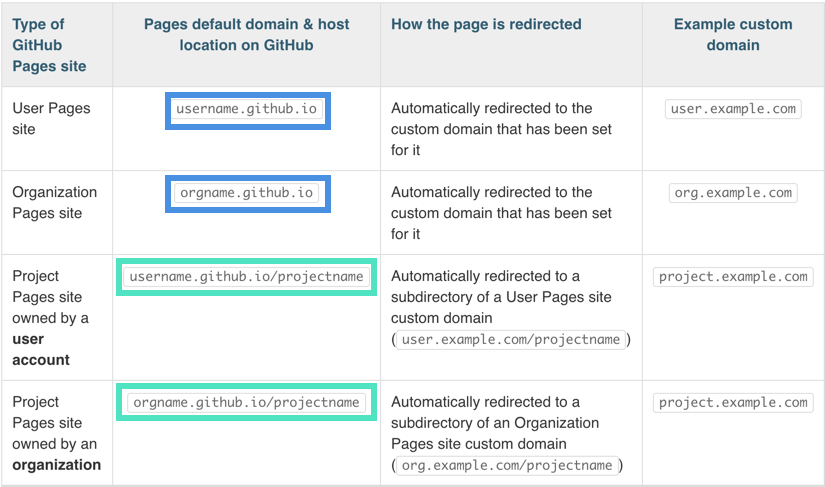
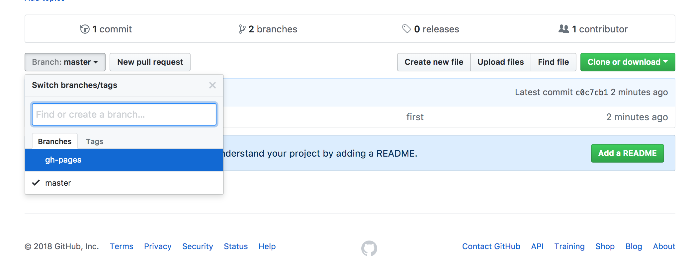
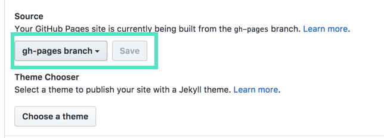
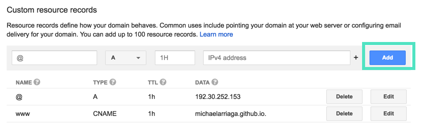

<!--
* TOC
{:toc} -->

**Before we begin:** this guide is specifically aimed at setting up a custom domain with **Google Domains**. Because of the differences in domain providers, the specific steps laid out in this guide may not work for you if you are using a domain provider other than Google Domains which is what this guide is specifically for.

### 1.0 Identifying our Github Pages default url.

Depending on whether the site we want to use is a project page `username.github.io/project` or our main `username.github.io` page (of which we only get one per github account), GitHub has a helpful chart on what the **default domain** is being used by Github-pages in these different cases.

(This chart also determines on **what branch you can host your site from** more on that later.)

###



Basically, it boils down to how we named the repository that we want to host. Github Pages has automatic hooks that determines if our repository is given a base url of `username.github.io/` to which all our additional pages are included in the path relative to our base url `username.github.io/PROJECT`

### 1.1 Creating a branch for specifically for Github-Pages

If you've named your repository the same as your github account example: `michaelarriaga.github.io` then you can skip this section since Github Pages automatically hosts your project from the `master` branch.

Github Pages requires all of our project pages to be served from a branch called `gh-pages` **only if** we want use a custom domain. In our case we do so lets create that branch now.

Let's quicky open up our terminal and create a new branch called `gh-pages`

```
$ git checkout -b gh-pages
>Switched to a new branch 'gh-pages'
```

Next, let's push our new branch up to Github.

```
git push --set-upstream origin gh-pages
```

We can now see that our repository has a new branch called `gh-pages`



Let's navigate to the settings section of our repository and choose our `gh-pages` branch as the source for our automatic pages domain and click save.



### 1.2 Creating a CNAME file

Assuming that we already have purchased our domain from google domains, we should already know what url we want google domains to point at for our Github Pages site.

Before we can do that however, we must tell Github Pages what the domain url is.

We have to create a file called `CNAME` that has no file extension and is in all caps inside the `root` directory of our site.

Back at our site's root directory let's create that file now. (If you are hosting a project site you must create your CNAME file on your `gh-pages` branch).

```
#Our CNAME file
www.ourdomain.com
ourdomain.com
```

**Note:** It's important that our file **does not** have an extension and that the filename is in all caps.

Now that our CNAME file has been created let's commit and push our changes to GitHub.

```
git add -A
git commit -m "Add a CNAME file"
git push
```

### 1.3 Configuring Google Domains

Over at our google domains list page, let's choose **DNS** so we can make some changes to the configuration.


Now, lets scroll down to **custom resource records** section and **add** some.



We need to add 3 custom resource records in order for Google Domains to properly point to our github pages site.

According to [Github Pages official documentation](https://help.github.com/articles/setting-up-an-apex-domain/) we must add "Two A records that point to your custom domain".

They use the following ip addresses:

```
192.30.252.153
192.30.252.154
```

Let's add them now.

```
#Name           Type   DATA
@               A      192.30.252.153
@               A      192.30.252.154
```

_Note: Google domains may say "This record is in use" this is usually fine and one IP resource record is usually good enough._

Finally, We want to create a third record `www` with a type of `CNAME` that has a data value of our `username.github.io`

```
www              A      username.github.io
```

AND WE'RE DONE!

Now we wait for our changes to have effect. It is very commonplace for domain configurations to take a long time to update. Sometimes it can take as long as 24 hours or more. _I've never had it take more than a couple hours to update my dns changes so don't worry if your domain and site aren't working immediately._
