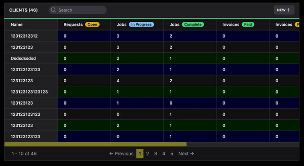

*Before we get started, **big thanks to [Pascal Laliberté](https://twitter.com/pascallaliberte), [Konnor Rogers](https://twitter.com/RogersKonnor), and [Adrian](https://twitter.com/Intrepidd) for their suggestions and feedback on X**, and **[Yaro Shmarov](https://twitter.com/yarotheslav)**'s article on **[Custom Turbo Actions](https://blog.corsego.com/custom-turbo-stream-actions)** for teaching me about Custom Turbo Actions and Events, making this article possible!*

Whenever we use a `turbo_stream` to update something on the page, it can be useful to detect when that update completes.

```erb
clients/search.turbo_stream.erb

<%= turbo_stream.update(:clients_table_body,
                        partial: 'clients',
                        locals: {
                            clients: @clients,
                            per_page: Client.per_page
                        })%>
```

This would be useful because when a `turbo_stream` finishes, we might want to **trigger an animation** or **change the styles of an element with a Stimulus Controller**.


## The Challenge

Currently, the only default event that we can listen to for turbo_streams, is called [turbo:before-stream-render](https://turbo.hotwired.dev/reference/events#streams)

This isn't applicable to us in this scenario because the event is fired before any elements on the page are updated.

But we can create our own [Custom Turbo Action](https://turbo.hotwired.dev/handbook/streams#custom-actions) that will fire a custom event named whatever we want when a `turbo_stream` finishes, so that we can listen for the event in a Stimulus Controller and do something when the event fires.


## Creating a Custom Turbo Action

1. Let's start by creating the **Custom Turbo Action** (In this case we will call it `dispatch_custom_event`)

```javascript
// app/javascript/application.js
import { Turbo } from "@hotwired/turbo-rails"
import "@hotwired/turbo-rails";
import "./controllers";

Turbo.StreamActions.dispatch_custom_event = function () {
    window.dispatchEvent(new Event(this.target))
};
```

2. Now let's trigger that event in our `turbo_stream`.

```erb
clients/search.turbo_stream.erb
...
<%= turbo_stream.action(:dispatch_custom_event, 'table_updated') %>
```

Here we're going to name this event `table_updated` for this example, we want to
re-colorize the rows of a table with a Stimulus Controller whenever
the table is updated, but you can name it whatever you want.

3. Now we can listen for our new Custom Event in either the `data-action` **attribute of an HTML element**, or inside a **Stimulus Controller**:

**Option 1: Listening inside the** `data-action` **attribute of an element:**

```erb
<tbody id="clients_table_body"
       data-controller="table-row-colorizer"
       data-action="table_updated@window->table-row-colorizer#colorizeRows">
      ...
</tbody>
```

**Option 2: Listening inside a Stimulus Controller:**

```javascript
import { Controller } from "@hotwired/stimulus";

export default class extends Controller {
  connect() {
    this.colorizeRows();
    window.addEventListener('table_updated', () => this.colorizeRows());
  }
  ...
}
```

## Results! Have a look at this example in action! 



Here I created a custom event called `table_updated` to colorize the rows of my table with a Stimulus Controller whenever the search input's value changes.

The search field form using `oninput` to submit the form:
```erb
clients/index.html.erb

<%= form_with url: users_clients_search_path, class: "flex flex-col justify-start max-w-xs md:flex-row md:space-y-0 md:space-x-3", method: :post do |form| %>
  <div class="relative w-48">
    <%= form.search_field :search_term,
      oninput: "this.form.requestSubmit()",
  ...
  </div>
<% end %>
```

The controller action called `search`:
```ruby
users/clients_controller.rb
class Users::ClientsController < Users::BaseController
  # users_clients_search_path POST
  def search
    @clients = if params[:search_term].blank?
      current_user.clients.paginate(page: params[:page], per_page: Client.per_page)
    else
      current_user.clients.where("contact_name ILIKE ?", "%#{params[:search_term]}")
    end

    respond_to do |format|
      format.turbo_stream
    end
  end
end
```

The turbo_stream that fires the custom event `table_updated`:

```ruby
<%= turbo_stream.update(:clients_table_body, partial: 'clients', locals: {clients: @clients, per_page: Client.per_page}) %>
<%= turbo_stream.action(:dispatch_custom_event, 'table_updated') %>
```

The element that listens for the custom event `table_updated`

```erb
<tbody id="clients_table_body"
       data-controller="table-row-colorizer"
       data-action="table_updated@window->table-row-colorizer#colorizeRows">
      ...
</tbody>
```

The Stimulus Controller that colorizes the rows:

```javascript

import { Controller } from "@hotwired/stimulus";

// Connects to data-controller="table-row-colorizer"
export default class extends Controller {
  static targets = ["row", "cell"];

  connect() {
    this.colors = ["#030333", "#111", "#020"];
    this.colorizeRows();
  }

  colorizeRows() {
    this.colorIndex = 0;

    this.rowTargets.forEach((row) => {
      row
        .querySelectorAll("[data-table-row-colorizer-target='cell']")
        .forEach((cell) => {
          cell.style.backgroundColor = this.colors[this.colorIndex];
        });
      this.colorIndex += 1;
      if (this.colorIndex > this.colors.length - 1) {
        this.colorIndex = 0;
      }
    });
  }
}

```
Now every time `turbo_stream.update()` completes,in our `search` controller action, the `table-row-colorizer` Stimulus Controller will run `colorizeRows()`!
